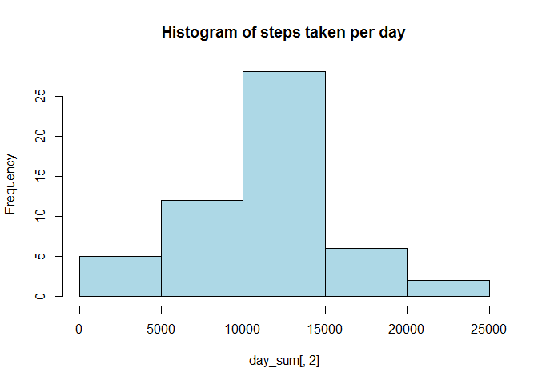
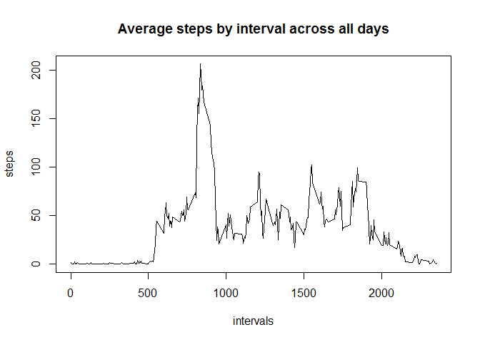
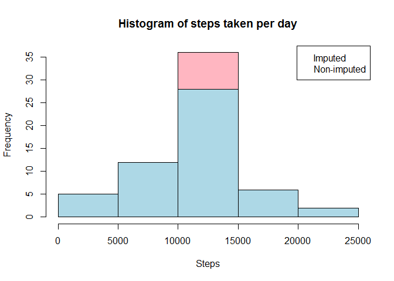

This project is to analyze data collected from FitBit.

Loading and preprocessing the data
----------------------------------

    d <- read.csv("activity.csv")

What is mean total number of steps taken per day?
-------------------------------------------------

    day_sum <- aggregate(d[,1], list(d$date),FUN=sum)
    #histogram of steps taken per day
    hist(x = day_sum[,2],main = "Histogram of steps taken per day", col = "lightblue")

    #calculate and report mean and median
    mean_day <- mean(day_sum$x,na.rm = TRUE)
    mean_day

    ## [1] 10766.19

    median_day <- median(day_sum$x, na.rm = TRUE)
    median_day

    ## [1] 10765

So the mean value of steps every day is 10766 and the median value of
steps per day is 10765.

What is the average daily activity pattern?
-------------------------------------------

    #plot time-series data by interval
    mean_interval <- aggregate(d[,1], list(d$interval), mean, na.rm = TRUE)
    plot(x = mean_interval[,1], y = mean_interval[,2],type = "l", xlab = "intervals", ylab="steps", main = "Average steps by interval across all days")

    #plot(y = d$steps, x=d$interval, type = "l", xlab = "5 min interval", ylab = "Steps", xaxt = "n"); axis(1, at = seq(0, 2500, by = 10))

Imputing missing values
-----------------------

Missing data needs to be imputed. A simple imputation was applied here
by replacing NAs with average steps in its relavent interval across all
days. For eamples, for interval 5 of 2012-10-02, the average step for
"interval 5" of all days was used to replace the NA.

    #count number of rows with NAs
    sum(is.na(d$steps))

    ## [1] 2304

    d_im <- d
    d_im <- transform(d, steps = ifelse(is.na(d$steps), mean_interval$x[match(d$interval, mean_interval$Group.1)],d$steps))

Then the new histogram on imputed data is created and mean and median of
imputed data is calculated.

    hist(x = day_sum[,2],main = "Histogram of steps taken per day (data_imputing", col = "lightpink")

    day_sum_im <- aggregate(d_im[,1], list(d_im$date),FUN=sum)
    mean_day_im <- mean(day_sum_im$x,na.rm = TRUE)
    mean_day_im

    ## [1] 10766.19

    median_day_im <- median(day_sum_im$x, na.rm = TRUE)
    median_day_im

    ## [1] 10766.19

    mean_interval_im <- aggregate(d_im[,1], list(d_im$interval), mean, na.rm = TRUE)

So there're difference in mean and median values between raw data and
imputed data.A histogram is shown below.

    hist(x = day_sum_im[,2],main = "Histogram of steps taken per day", col = "lightpink", xlab = "Steps")
    hist(day_sum$x, main = "Total Steps every Day", col="lightblue", xlab="Number of Steps", add=T)
    legend("topright", c("Imputed", "Non-imputed"), col=c("lightpink", "lightblue"))

Are there differences in activity patterns between weekdays and weekends?
-------------------------------------------------------------------------

The difference is displayed in the line plot below.

    weekdays <- c("Monday", "Tuesday", "Wedesday", "Thursday", 
    "Friday")
    d_im$dow = as.factor(ifelse(is.element(weekdays(as.Date(d_im$date)),weekdays), "Weekday", "Weekend"))

    steps_by_interval_i <- aggregate(steps ~ interval + dow, d_im, mean)

    library(ggplot2)

    ## Warning: package 'ggplot2' was built under R version 3.4.3

    ggplot(data=steps_by_interval_i,aes(x=interval, y=steps, group = dow))+
    geom_line(position = position_dodge(), aes(colour=dow))

    ## Warning: Width not defined. Set with `position_dodge(width = ?)`

